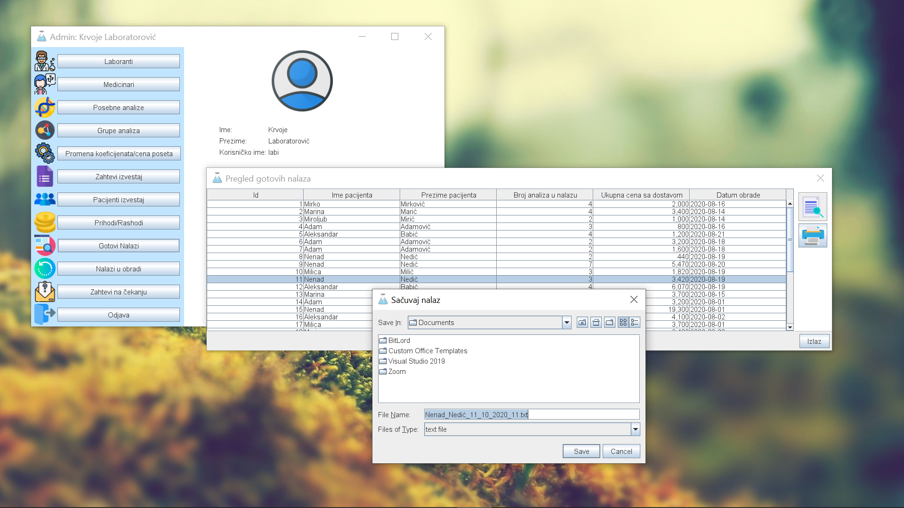
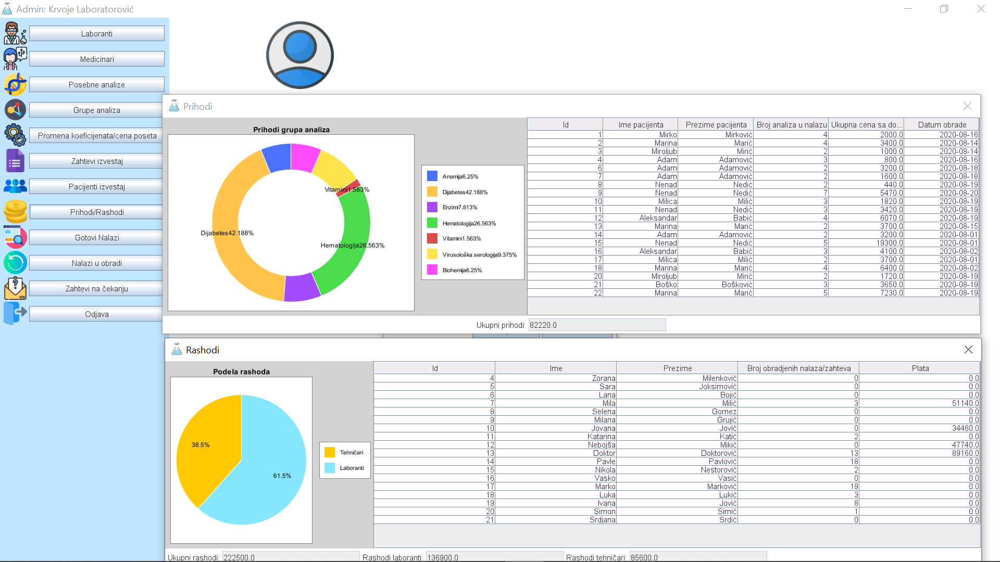
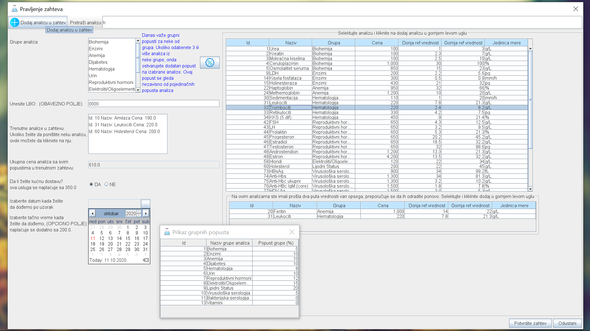
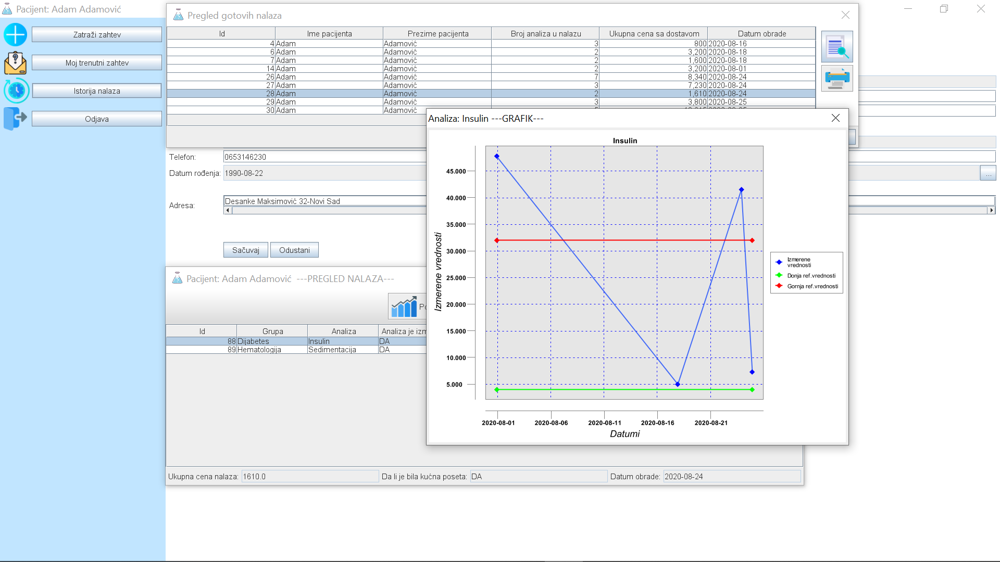
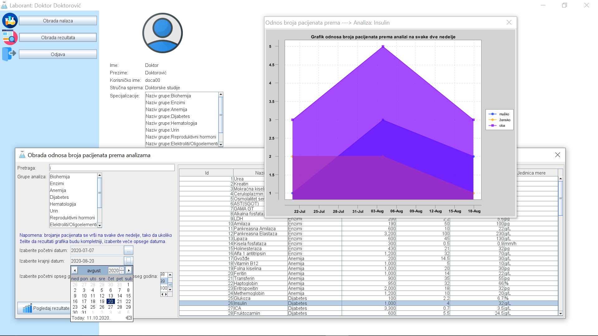

# OOP1-Java-Swing-Aplikacija

Projekat iz predmeta objektno orijentisano programiranje 1 na FTN-u u Novom Sadu.

Potrebno je bilo napraviti java gui aplikaciju koristeci Swing za graficki prikaz.

Aplikacije simulira rad izmisljene firme za obradu raznih analiza krvi. Detaljnu specifikaciju mozete pogledati u folderu **specifikacijaProjekta**

Postoji vise korisnika sistema:
- admin
- laborant
- medicinski tehnicar
- pacijent

U fajlu **res/res/data.korisnici.txt** mozete pronaci potrebne informacije za **log in** i ostale zahteve

Neki od cesto testiran korisnika su:

| ULOGA               | KORISNICKO IME | LOZINKA      |
| -----------------   | -------------- | ------------ |
| admin               | labi           | labi         |
| laborant            | doca00         | doca00       | 
| medicinski tehnicar | katarina       | kata123      |
| pacijent            | adam           | adam123      | 

LBO broj potreban za adama iznosi **0000**

Ukoliko je potrebno uzimati opsege datuma koristiti datume od **1.8.2020. do 20.8.2020** buducu da je u tom periodu pravljena aplikacija i ima najvise podataka

## Pokretanje:
Pokrenuti Aplikacija.java u paketu src/main ili skinuti aplikaciju u obliku jar fajla - **LABI.jar**

## Isečci iz aplikacije:

